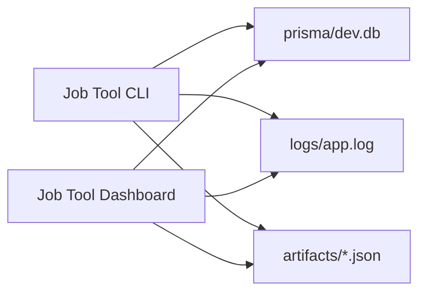

# 🚀 Job Tool

> A local-first TypeScript engine for evaluating jobs, scoring fit, preparing application answers, and running controlled apply workflows.

[](https://www.typescriptlang.org/)
[](https://www.prisma.io/)
[](https://playwright.dev/)
[](./LICENSE)

Job Tool is the automation engine behind the Job Tool workspace. It reads job postings, compares them against a candidate profile, scores the match, records the decision trail, and can continue into LinkedIn Easy Apply or external application flows when configured.

The companion UI lives in the sibling `Job Tool Dashboard` project.

## ✨ What It Does

| Area | Purpose |
| --- | --- |
| Job extraction | Reads LinkedIn, ReactJobs, Ashby, Greenhouse, Lever, Workable-style, and generic job/application pages. |
| Scoring | Uses deterministic policy checks or a configured LLM scoring mode. |
| Candidate context | Builds and reuses a local candidate profile and resume-derived facts. |
| Apply automation | Supports LinkedIn Easy Apply and external apply handoff flows, including dry runs. |
| Persistence | Writes review history, recommendations, decisions, logs, and JSON artifacts. |
| Observability | Produces structured logs and run reports that the dashboard can read live. |

## 🧭 Workspace Shape

```text
Desktop/
  Job Tool/             # engine, CLI, database, logs, artifacts
  Job Tool Dashboard/   # Next.js UI connected through ENGINE_ROOT
```

The engine is intentionally local-first. Secrets, browser sessions, personal profile data, resumes, logs, and generated artifacts stay in your machine-local workspace.

## ⚡ Quick Start

```bash
npm install
cp .env.example .env
npx prisma generate
npx prisma migrate dev
npm run type-check
```

Then run a first read-only command:

```bash
npm run dev -- dashboard --limit 5
```

## 🔧 Environment

Create `.env` from `.env.example`, then fill only the values you need:

```env
LLM_PROVIDER=local
LOCAL_LLM_BASE_URL=http://127.0.0.1:1234/v1
LOCAL_LLM_MODEL=openai/gpt-oss-20b
DATABASE_URL="file:./dev.db"
LINKEDIN_SESSION_STATE_PATH=.auth/linkedin-session.json
LINKEDIN_BROWSER_PROFILE_PATH=.auth/linkedin-profile
```

OpenAI-compatible local providers such as LM Studio work through `LOCAL_LLM_BASE_URL`. The dashboard checks this same configuration when it reports local readiness.

## 🧪 Common Commands

```bash
# Snapshot persisted data
npm run dev -- dashboard --limit 10

# Evaluate a single job without applying
npm run dev -- decide "https://www.linkedin.com/jobs/view/123"
npm run dev -- score "https://www.linkedin.com/jobs/view/123" --scoring ai
npm run dev -- explore "https://www.linkedin.com/jobs/view/123"

# Evaluate a LinkedIn collection and save recommendations only
npm run dev -- explore-batch "https://www.linkedin.com/jobs/collections/top-applicant" --count 25 --score-threshold 40 --scoring ai

# Dry-run application flows
npm run dev -- apply "https://www.linkedin.com/jobs/view/123" --dry-run --resume "./user/resume.pdf"
npm run dev -- apply-batch "https://www.linkedin.com/jobs/collections/easy-apply" --count 25 --dry-run --resume "./user/resume.pdf"

# Live apply flows
npm run dev -- apply "https://www.linkedin.com/jobs/view/123" --resume "./user/resume.pdf"
npm run dev -- apply-batch "https://www.linkedin.com/jobs/collections/easy-apply" --count 25 --score-threshold 40 --resume "./user/resume.pdf" --scoring ai

# Candidate and answer utilities
npm run dev -- build-profile --resume "./user/resume.pdf" --linkedin "https://linkedin.com/in/your-handle"
npm run dev -- answer-questions --resume "./user/resume.pdf" --questions "./questions.json"
npm run dev -- resume-incomplete --report "./artifacts/batch-runs/latest-apply-batch.json"
```

Legacy aliases such as `easy-apply`, `easy-apply-batch`, `easy-apply-dry-run`, `external-apply`, and `external-apply-dry-run` are still supported for older workflows.

## 🎛️ Modes At A Glance

| Mode | Applies? | Writes DB? | Best for |
| --- | --- | --- | --- |
| `dashboard` | No | No | CLI summary of persisted data. |
| `decide` / `score` | No | Yes | Single-job fit checks. |
| `explore` | No | Yes | Saving one recommendation. |
| `explore-batch` | No | Yes | Building a recommendation queue from a collection. |
| `apply --dry-run` | No final submit | Yes | Rehearsing forms and answer logic. |
| `apply` | Can submit | Yes | Applying to one approved job. |
| `apply-batch --dry-run` | No final submit | Yes | Batch rehearsal. |
| `apply-batch` | Can submit | Yes | Batch apply with scoring gates. |

## 🔄 Engine To Dashboard Flow



The dashboard does not replace the engine. It reads the engine's database/logs/artifacts, starts engine commands through local API routes, and follows progress from the same persisted outputs.

## ✅ Testing

```bash
npm run type-check
npm test
```

Live provider-backed tests are separate:

```bash
npm run test:local-llm
```

The default suite is designed to run without LM Studio, OpenAI, or a live LinkedIn session.

## 🔐 Local Files

| Path | Purpose |
| --- | --- |
| `user/profile.example.json` | Tracked starter profile. |
| `user/profile.json` | Local personal profile override. Ignored by Git. |
| `user/resume.pdf` | Optional default resume input. Ignored by Git. |
| `.auth/linkedin-session.json` | Local browser session state. Ignored by Git. |
| `.auth/linkedin-profile/` | Persistent Playwright profile. Ignored by Git. |
| `logs/app.log` | Structured runtime log. |
| `artifacts/` | JSON reports, screenshots, and run diagnostics. |

## 📚 Documentation

- [docs/README.md](./docs/README.md): documentation entrypoint
- [docs/TASK_GUIDE.md](./docs/TASK_GUIDE.md): where to start for common changes
- [docs/SOURCE_FILE_MAP.md](./docs/SOURCE_FILE_MAP.md): source ownership map
- [docs/FUNCTION_INDEX.md](./docs/FUNCTION_INDEX.md): function-level index
- [docs/TEST_STRATEGY.md](./docs/TEST_STRATEGY.md): test coverage strategy
- [example-scripts.md](./example-scripts.md): copyable PowerShell `tsx` wrappers

## 📄 License

Source-available under the [PolyForm Noncommercial 1.0.0](./LICENSE) license. Personal and non-commercial use are allowed. Commercial use requires separate permission.
