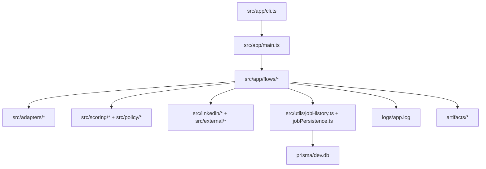

# 📚 Job Tool Documentation

This folder is the navigation layer for the Job Tool engine. It is written for humans and coding agents who need to understand the system quickly without opening every source file first.

## 🧭 Start Here

| Document | Use it when you need to... |
| --- | --- |
| [ROOT_FILE_MAP.md](./ROOT_FILE_MAP.md) | Understand root files, local data, and project entrypoints. |
| [SOURCE_FILE_MAP.md](./SOURCE_FILE_MAP.md) | Find the source module that owns a feature. |
| [FUNCTION_INDEX.md](./FUNCTION_INDEX.md) | Jump from behavior to function names. |
| [TASK_GUIDE.md](./TASK_GUIDE.md) | Pick the first files to open for common tasks. |
| [TEST_STRATEGY.md](./TEST_STRATEGY.md) | Decide what test coverage belongs with a change. |
| [TEST_FILE_MAP.md](./TEST_FILE_MAP.md) | Find tests that protect a behavior. |
| [PRISMA_FILE_MAP.md](./PRISMA_FILE_MAP.md) | Understand schema and migration ownership. |
| [PERSISTENCE_POLICY.md](./PERSISTENCE_POLICY.md) | Understand what is persisted and why. |

## 🗺️ System Map

## 🔎 Reading Order For Most Changes

1. Open [TASK_GUIDE.md](./TASK_GUIDE.md) and find the task.
2. Open the listed source files only.
3. Check [FUNCTION_INDEX.md](./FUNCTION_INDEX.md) for the relevant function.
4. Open the matching tests from [TEST_FILE_MAP.md](./TEST_FILE_MAP.md).
5. Update this docs folder when file ownership or commands change.

## 📦 Runtime Outputs

The engine produces the data that the dashboard reads:

| Output | Location | Dashboard use |
| --- | --- | --- |
| SQLite database | `prisma/dev.db` | stats, recommendations, reviews, decisions, companies, answers |
| Structured logs | `logs/app.log` | run activity, failures, current job inference |
| JSON artifacts | `artifacts/` | batch reports, external apply diagnostics, screenshots |
| Local browser state | `.auth/` | LinkedIn session continuity |
| User profile/resume | `user/` | candidate context and answer generation |

## 🛠️ Maintenance Rules

- Keep docs concise and navigable.
- Prefer file ownership and behavior summaries over long implementation essays.
- Do not document local secrets or personal profile data.
- When a dashboard-facing output changes, update both this docs folder and the dashboard docs.
- When a command shape changes, update [../README.md](../README.md) and [../example-scripts.md](../example-scripts.md).
